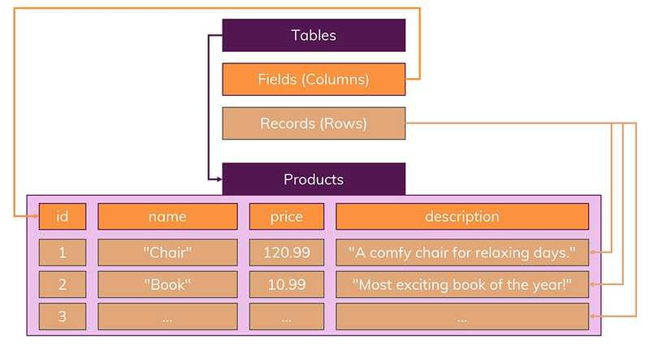
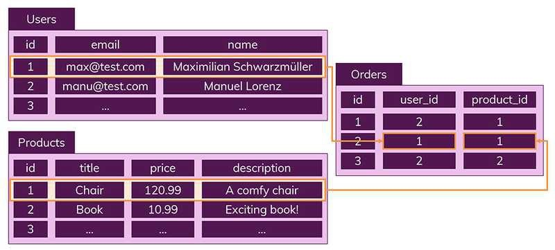
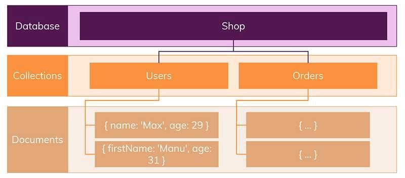
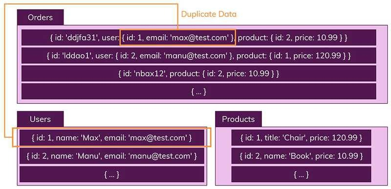

# SQL과 NoSQL

### SQL

Structured Query Language (구조적 질의 언어)이다. SQL을 통해 RDBMS(관계형 데이터베이스 관리 시스템)에서 데이터를 저장, 수정, 삭제 및 검색을 할 수 있다. 

 

**관계형 데이터베이스 특징**

- 데이터는 정해진 데이터 스키마를 따라 데이터베이스 테이블에 저장된다.
- 데이터는 관계를 통해서 연결된 여러 개의 테이블에 분산된다.

 

**정해진 스키마**

데이터는 테이블에 레코드로 저장되며, 각 테이블에는 명확하게 정의된 구조(structure)가 있다. 구조는 필드의 이름과 데이터 유형으로 정의된다.

스키마를 준수하지 않은 레코드는 절대 추가할 수 없다. 만약 필드를 추가하고 싶거나 누락된 필드가 있다면 새로운 테이블을 생성하여 레코드를 추가해야 한다.

> 스키마 : 데이터베이스에서 자료의 구조, 표현 방법, 자료 간의 관계를 형식 언어로 정의한 구조

 

**관계**

데이터의 중복을 방지하기 위해 데이터들을 여러 테이블로 나누어 저장한다. Users(사용자), Products(상품), Orders(주문 상품) 등 여러 테이블이 존재할 때, 각각의 테이블들은 서로 다른 테이블에 저장되지 않은 고유한 데이터만을 저장하고 있다.

 

 

### NoSQL

NoSQL은 SQL 데이터베이스와 다르게 스키마와 관계가 없다. 테이블은 컬렉션(Collection), 레코드는 문서(Documents)라고 부른다. SQL에서는 정해진 스키마를 따르지 않는다면 데이터를 추가할 수 없지만 NoSQL에서는 다른 구조의 데이터를 같은 컬렉션에 추가할 수 있다.

`Users` 컬렉션을 보면 데이터 구조가 첫번째는 `name`과 `age`인데, 두번째는 `firstName`과 `age` 임을 알 수 있다. 

NoSQL은 Join이 필요하지 않는데, 이는 관련 데이터를 동일한 컬렉션에 넣어서 한꺼번에 관리하기 때문에 가능하다. Users와 Products, Orders 각각 데이터를 관리하는 것이 아니라 필요한 정보를 모두 Orders 컬렉션에 넣어 관리한다.

 

 

### SQL과 NoSQL

**SQL 장점**

- 명확하게 정의된 스키마로 인한 데이터 무결성 보장이 가능하다.
- 데이터를 중복없이 저장, 관리할 수 있다.

**SQL 단점**

- 데이터 스키마를 사전에 계획해야 하기 때문에 유연성이 떨어진다.
- 조인문으로 인한 복잡한 쿼리가 만들어질 수 있다.

**NoSQL 장점**

- 스키마가 없어서 유연하다. 언제든지 저장된 데이터를 조정하고 새로운 필드를 추가할 수 있다.
- 데이터를 읽어오는 속도가 필요하다. (조인 없으므로)

**NoSQL 단점**

- 데이터 중복을 계속 업데이트 해야 한다.
- 데이터가 여러 컬렉션에 중복되어 있기 때문에 수정 시 모든 컬렉션에서 수행해야 한다.

 

 

### 언제 사용할까

**SQL**

- 관계를 맺고 있는 데이터가 자주 변경되는 경우
  - NoSQL은 여러 컬렉션을 모두 수정해야 하기 때문에 비효율적이다.
- 변경될 여지가 없고, 명확한 스키마가 중요한 경우

**NoSQL**

- 정확한 데이터 구조를 알 수 없거나 변경/확장 될 수 있는 경우
- 읽기를 자주 하지만, 수정은 거의 하지 않는 경우
