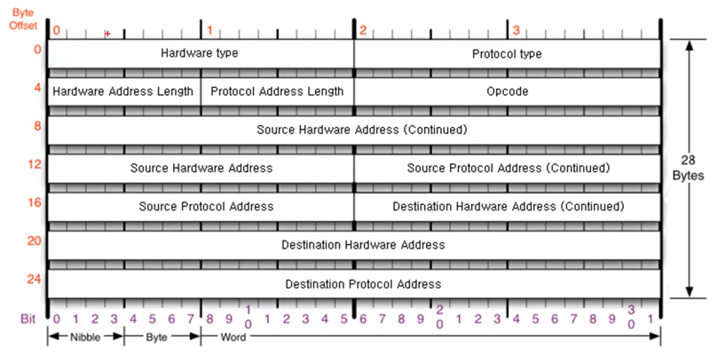

# ARP

### ARP

같은 네트워크 대역에서 통신을 하기 위해 필요한 것은 MAC 주소이다. 이러한 MAC 주소를 IP 주소를 통해 알아오는 프로토콜이 바로 ARP이다. 같은 네트워크 대역에서 통신을 하더라도 데이터를 전송하기 위해서는 7계층부터 캡슐화를 통해 데이터를 보내기 때문에 IP 주소와 MAC 주소가 모두 필요하다. 이 때 IP 주소는 알고, MAC 주소는 모르더라도 ARP 프로토콜을 통해 통신이 가능하다.

</br>

</br>

### ARP 구조



**Hardware type** : 2계층에서 사용하는 프로토콜 type

**Protocol type** : 프로토콜 주소의 type

**Hardware Address Length** : MAC 주소의 길이

**Protocol Address Length** : IPv4 주소 길이

**OPcode** : 어떻게 동작하는 나타내는 코드

**Source Hardware Address** : 출발지 MAC 주소

**Source Protocol Address** : 출발지 IPv4

**Destination Hardware Address** : 목적지 MAC 주소

**Destination Protocol Address** : 목적지 IPv4

</br>
</br>

### ARP 프로토콜 통신 과정

같은 LAN 대역에서 **ARP 프로토콜로 상대방의 MAC 주소를 알아오는 과정**을 알아보자.

먼저 A컴퓨터(192.168.0.10)가 C컴퓨터(192.168.0.30)와 통신하려고 할 때, A컴퓨터는 C컴퓨터에게 요청을 보낸다. 

- A 컴퓨터가 C 컴퓨터에게 ARP 요청 프로토콜을 만든다.
- ARP 프로토콜은 3계층이기 때문에 앞에 2계층인 이더넷 프로토콜을 붙인다.
- 이더넷 프로토콜을 붙일 때, 출발지 IP와 MAC 주소는 본인의 주소를 작성한다. 목적지 MAC 주소는 모르기 때문에 00 00 00 00 으로 비워두고, IP 주소만 기재한다.

이더넷 프로토콜을 인캡슐레이션해서 보낸다.

- 목적지 MAC 주소는 모르기 때문에 FF FF FF FF FF FF 로 작성한다. (브로드캐스트)
- 프로토콜을 작성해서 같은 네트워크 대역에 있는 모두에게 전송한다.

Switch 장비를 거친다.

- 2계층인 이더넷 프로토콜만 디캡슐레이션한다.
- 이더넷의 목적지 MAC 주소가 브로드캐스트 이므로 같은 대역에 있는 모든 장비에게 보낸다.

모든 장비들은 받은 패킷 내용을 디캡슐레이션한다.

- ARP 프로토콜을 확인하고, 본인의 IP 주소와 목적지 IP 주소가 일치하지 않는다면 패킷을 버리고, 일치한다면 ARP 응답 프로토콜을 만들어서 보낸다.
- 출발지 MAC 주소에 본인의 MAC 주소를 기재해서 보낸다.

Switch 장비를 거친다.

- 이더넷 프로토콜에 해당하는 장비에게 보낸다.

응답받은 장비에서 ARP 응답을 확인한다.

- 디캡슐레이션을 통해 MAC 주소를 확인하고, ARP 캐시테이블에 해당 IP와 MAC 주소를 등록한다.

> 쉽게 설명하면..!
>
> 한 네트워크 대역에 A, B, C, 공유기까지 네 개의 장비가 있다. A는 특정 IP(C)와 통신을 하기 위해 해당 MAC 주소를 알고 싶다. A는 ARP 요청을 작성하고, 이더넷 프로토콜로 캡슐화한다. 이때, 이더넷 프로토콜의 목적지 MAC 주소를 브로드 캐스트로 작성한다. 캡슐화한 요청을 스위치로 보내고, 스위치는 이더넷 프로토콜의 MAC 주소를 확인한다. 목적지는 브로드캐스트이므로 모든 장비에게 요청이 전달되는데, 각 장비는 받은 요청을 확인해서 자신의 IP 주소와 목적지 주소가 같다면 ARP 응답을 한다. A는 C의 MAC 주소가 포함된 ARP 응답을 받게 되고, ARP 캐시 테이블에 C의 IP 주소에 해당하는 MAC 주소를 기억한다.

</br>

</br>

### ARP 테이블

통신했던 컴퓨터 주소는 ARP 테이블에 남게 된다. ARP 캐시테이블을 확인하는 방법은 아래와 같다.

```
arp -a
```


