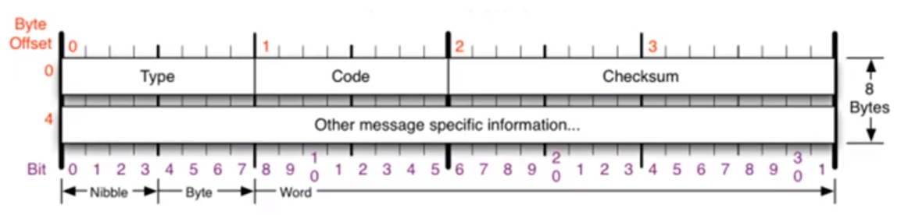

# IP

네트워크에 연결된 통신 기기는 서로 데이터를 주고 받기 위한 개별 주소를 가지고 있다. 이러한 주소 체계를 IP (Internet Protocol) 이라고 한다. IP 주소는 통신기기마다 고유하게 할당되어 있는 것이 아닌 경우에 따라 바뀔 수 있다. Private IP와 Public IP로 나눠진다.

- 비연결성 : 패킷을 받을 대상이 없거나 특정한 이유로 서비스 불능 상태에 빠져도 데이터를 받을 상대의 상태 파악이 불가능하기 때문에 패킷을 그대로 전송하게 된다.
- 비신뢰성 : 중간에 패킷이 사라지더라도 보내는 측에서는 알 수 있는 방법이 없다. 또한 서로 다른 노드를 거쳐서 전송되는 특성때문에 보내는 측에서 의도한 순서대로 데이터가 도착하지 않을 수 있다.

 

 

### IPv4

IPv4는 Internet Protocol version 4의 약어로, 32비트 주소 체계를 갖는 네트워크 계층의 프로토콜이다. `.` 으로 구분하는 4개의 옥텟 (8비트 묶음)으로 구성되어 있다. 10진수로 표현하면 각각의 옥텟은 0~255로 표현할 수 있다.  IP 주소는 **Network Part**와 **Host Part**로 나뉘게 된다. 두 파트를 구분하는 방법은 서브넷 마스크를 사용하는 것이다.

IPv4로 표현 가능한 IP 주소는 0.0.0.0 ~ 255.255.255.255이다. 인터넷 사용자의 증가로 인해 주소 공간이 고갈되어 128비트 주소 체계를 갖는 IPv6가 확산되고 있다.

 
 

### ICMP

Internet Control Message Protocol의 약자로, 특정 대상과 통신이 잘되는지 확인하는 프로토콜이다. 주로 네트워크 컴퓨터 위에서 돌아가는 운영체제에서 오류 메시지를 전송받는데 사용된다. 프로토콜 구조의 Type과 Code를 통해 오류 메시지를 전송 받는다.

- IP 통신의 에러 상황을 출발지에 전달하고 메시지 제어하는 역할을 한다.
- IPv4 패킷으로 캡슐화되어 있다.
- Ping & Traceroute 명령어를 사용한다.

- Type : ICMP 메시지 종류
- Code : 메시지 Type 별 세부 코드 정보
- Checksum : ICMP 헤더 손상 여부 확인

 
 

### IPv4의 조각화

큰 IP 패킷들이 적은 MTU를 갖는 링크를 통하여 전송되려면 여러 개의 작은 패킷으로 조각화되어 전송되어야 한다. 즉 목적지까지 패킷을 전달하는 과정에 통과하는 각 라우터마다 전송에 적합한 프레임으로 변환이 필요하다.

일단 조각화되면 최종 목적지에 도달할 때까지 재조립되지 않는다. IPv4에서는 발신지 뿐만 아니라 중간 라우터에서도 IP 조각화가 가능하다. IPv6에서는 IP 단편화가 발신지에서만 가능하고, 재조립은 항상 최종 수신지에서만 가능하다.
