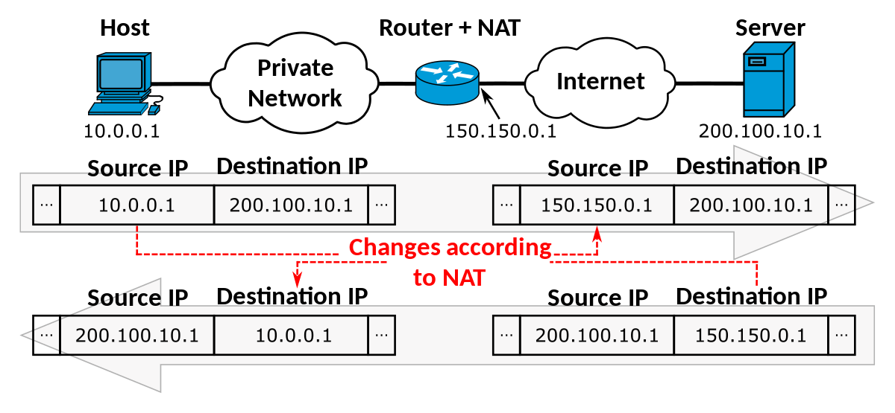

# NAT (Network Address Translation)

### NAT

NAT는 네트워크 주소 변환이라는 의미로, 출발지 및 목적지의 IP주소 및 TCP/UDP 포트 번호를 재기록하여 라우터를 통해 데이터를 주고 받는 기술이다. 내부망에서 외부망으로 통신 시 출발지의 Private IP 주소를 Public IP 주소로 변환하여 외부로 나가게 된다. 다시 내부망으로 돌아올 때는 목적지의 Public IP 주소 -> Private IP 주소로 변환된다.

 

 

### NAT 왜 사용할까?

#### IP 주소 절약

NAT을 사용하면 하나의 공인 IP 주소를 사용하여 여러 대의 호스트가 인터넷에 접속할 수 있다. 집에 있는 인터넷 회선을 통해 인터넷 공유기를 설치해서 여러 PC를 연결하는 것이 그 예이다. NAT을 통해 부족한 공인 IP를 절약할 수 있다.

#### 보안

NAT의 동작은 IP를 숨길 수 있는 기능이 있다. 외부로 통신 시 Private IP는 Public IP로 변환되기 때문에 공격자는 라우터 안 쪽의 Private IP를 알 수 없다.

 

 

### NAT 통신

NAT 통신은 다음과 같은 과정으로 이루어진다.

먼저 패킷 헤더에 출발지와 목적지의 주소를 기록한다.

- 출발지 : 10.0.0.1

- 목적지 : 200.100.10.1

 

게이트웨이 (라우터) 에서 외부로 나가는 패킷을 인지하면 출발지를 Public IP로 변경한다.

- 출발지 : 150.150.0.1
- 목적지 : 200.100.10.1

이때, NAT 테이블에 기록한다.

| 프로토콜 | 사설 IP 주소 |   출발지    |    목적지    |
| :------: | :----------: | :---------: | :----------: |
|   TCP    |   10.0.0.1   | 150.150.0.1 | 200.100.10.1 |

 

요청이 처리되면 응답 패킷에 출발지와 목적지의 주소를 기록한다.

- 출발지 : 200.100.10.1
- 목적지 : 150.150.0.1

 

게이트웨이에서 받을 때 NAT 테이블을 참조하여 최종목적지를 Private IP로 변경한다.

- 출발지 : 213.14.132.3
- 목적지 : 192.0.0.10

이때, 호스트가 여러 개일 경우 게이트웨이에서는 이를 구분하기 위해 PAT방법을 이용한다.

> PAT (Port Address Translation)
>
> 기존 IP에서 Port가 추가되어 포트로 구분하는 것이다.