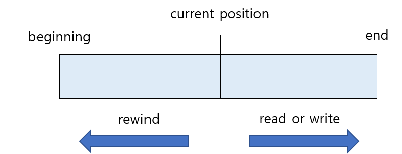
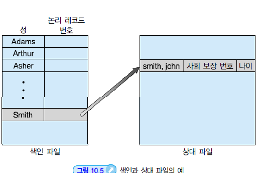
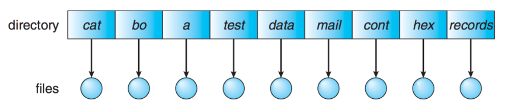
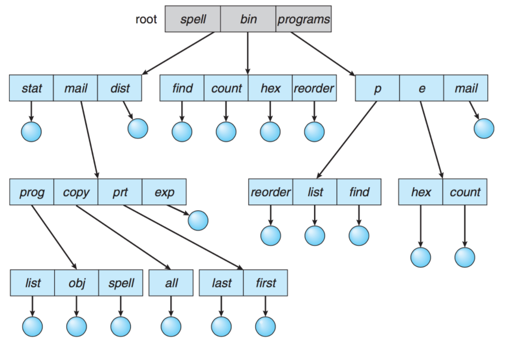
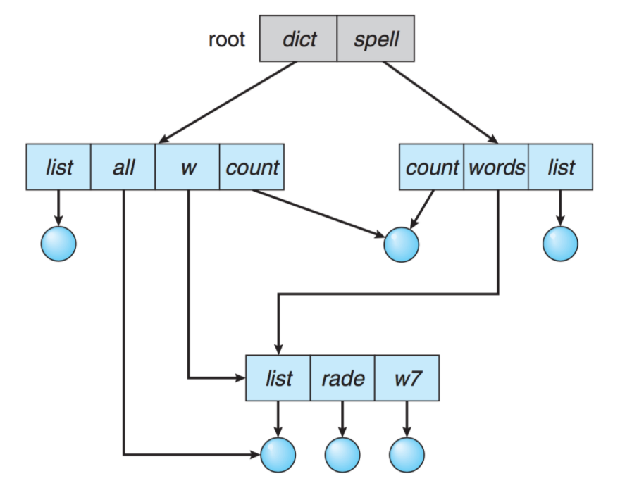
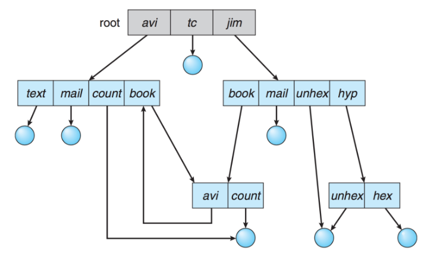

# 파일 시스템

### 💾 파일과 파일 시스템

**파일(File)**은 논리적인 저장 단위로, 관련된 정보 자료들의 집합에 이름을 붙인 것이다. 컴퓨터 시스템의 편리한 사용을 위해 정보 저장의 일괄된 논리적 관점을 제공한다.

**파일 속성(File attribute)**은 파일을 관리하기 위한 각종 정보들이다. 파일 자체의 내용은 아니며 파일 이름, 유형, 파일 사이즈, 접근 권한 등 파일에 대한 전반적인 정보를 말한다.

**파일 시스템(File System)**은 운영체제와 모든 데이터, 프로그램의 저장과 접근을 위한 기법을 제공한다. 시스템 내의 모든 파일에 관한 정보를 제공하는 계층적 디렉터리 구조이고, 파일 및 파일의 메타데이터, 디렉터리 정보 등을 관리한다. 즉 파일을 유지하고 관리하는 방법이다.

 

 

### Access Methods

**순차 접근(Sequential Access)**

가장 단순한 방법으로 파일의 정보가 레코드 순서대로 처리된다. 현재 위치에서 읽거나 쓰면 offset이 자동으로 증가하고, 뒤로 돌아가기 위해서는 되감기가 필요하다. 카세트 테이프를 사용하는 방식과 동일한다.

 

**직접 접근(Random Access)**

파일의 레코드를 임의의 순서로 접근할 수 있다. 읽기나 쓰기의 순서 제약이 없으며 현재 위치를 유지할 수 있다면 이를 통해 순차 접근 기능도 구현할 수 있다. 

 

**색인 접근(Index Access)**

파일에서 레코드를 찾기 위해 색인을 먼저 찾고, 대응되는 포인터를 얻는다. 이를 통해 직접 접근하여 원하는 데이터를 얻을 수 있다. 따라서 크기가 큰 파일에서 유용하다.

 

 

### 디렉터리 (Directory)

디렉터리는 파일의 메타데이터 중 일부를 보관하고 있는 일종의 특별한 파일이다. 다음과 같은 기능을 제공한다.

- 파일 찾기
- 파일 생성
- 파일 삭제
- 디렉터리 나열
- 파일 시스템 순회

 

**1단계 디렉터리 (Single-Level Directory)**

1단계 디렉터리는 모든 파일들이 디렉터리 밑에 존재하는 형태이다. 파일들은 서로 유일한 이름을 가지고 서로 다른 사용자라도 같은 이름을 사용할 수 없다. 이해하기 쉽지만 파일이 많아지거나 다수의 사용자가 사용하는 시스템에서는 제약을 받을 수 있다.

 

**2단계 디렉터리(Two-Level Directory)**

2단계 디렉터리는 각 사용자별로 별도의 디렉터리를 갖는 형태이다. 

- UFD(User File Directory) : 자신만의 사용자 파일 디렉터리
- MFD(Master File Directory) : 사용자의 이름과 계정번호로 색인되어 있는 디렉터리. 한 사용자의 UFD를 다른 사용자가 접근할 수 없기 때문에 파일을 공유해서 사용하는 경우는 공유가 불가능하다.

 

**트리 구조 디렉터리(Tree-Structured Directory)**

****

사용자들이 자신의 서브 디렉터리를 만들어서 파일을 구성할 수 있다. 하나의 루트 디렉터리를 가지며 모든 파일은 고유한 경로를 가진다. 효율적인 탐색이 가능하고, 그룹화 할 수 있다.

 

**비순환 그래프 디렉터리(Acyclic-Graph Directory)**

디렉터리들이 서브 디렉터리들과 파일을 공유할 수 있도록 한다. 

 

**일반 그래프 디렉터리(General Graph Directory)**

순환을 허용하는 그래프 구조이다. 순환이 허용되면 무한 루프에 빠질 수 있다. 디렉터리와 파일 공유에 융통성이 있고, 파일과 디렉터리를 액세스하기 쉽다. 