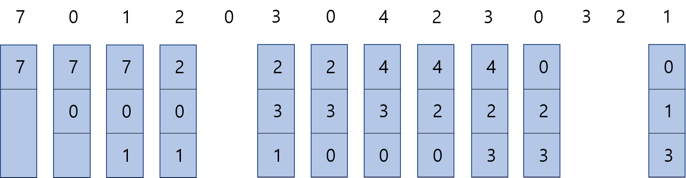
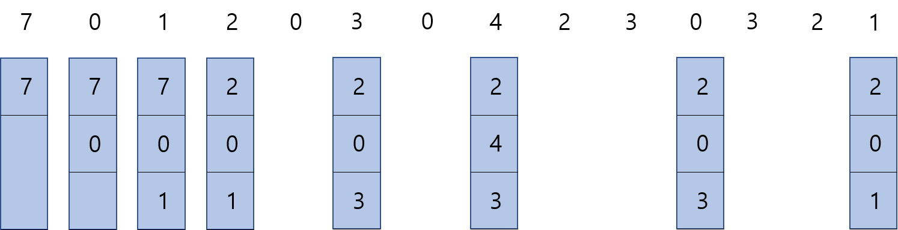
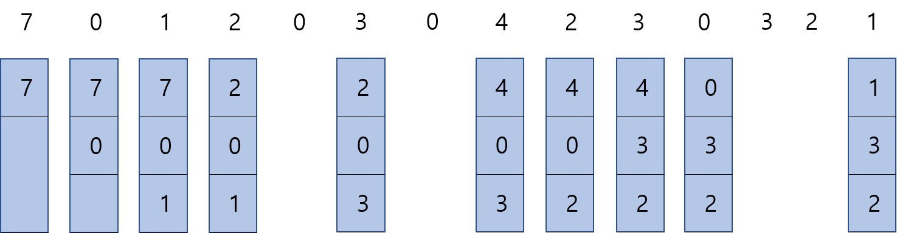

# 페이지 교체 알고리즘

### 📜 페이지 교체

페이지 부재가 발생했을 때, 어떻게 페이지를 교체할 것인지에 대해 결정하는 방법이다. 가상 메모리는 필요한 페이지만 메모리에 적재하는데, 메모리 용량이 모두 차게 될 경우에 어떤 페이지를 out 시켜야 하는지 결정해야 한다.  이와 같은 상황에 맞는 페이지 교체를 진행하기 위해 페이지 교체 알고리즘을 사용한다. 이렇게 out되는 페이지를 victim page라고 부른다.

> 페이지 부재 : CPU가 접근하려는 페이지가 메모리에 없는 경우, 이를 페이지 부재라고 한다.

 

 

### FIFO 알고리즘

First-in First-out 알고리즘. 메모리에 가장 먼저 올라온 페이지를 먼저 내보내는 것이다. 가장 간단한 방법으로, 초기화 코드에서 적절한 방법이다. 초기화 코드는 처음 프로세스 실행 시 딱 한번 사용하는 것이므로 초기화 후에 FIFO대로 가장 먼저 내보낼 수 있다.

> 초기화 코드 : 처음 프로세스 실행될 때, 최초 초기화를 시키는 역할만 진행하고 다른 역할은 수행하지 않는 것이다.

FIFO 방식으로 페이지를 교체하면 위 그림에서는 총 8번의 페이지 교체가 발생한다.

 

 

### OPT 알고리즘

Optimal 알고리즘. 앞으로 가장 오랫동안 사용되지 않을 페이지를 교체하는 것이다. 가장 이상적인 알고리즘이지만 실질적으로 페이지가 앞으로 잘 사용되지 않을 것이라는 정확한 보장이 없기 때문에 수행하기 어렵다.

총 5번의 페이지 교체가 발생한다.

 

 

### LRU 알고리즘

Least Recently Used 알고리즘. 가장 오랫동안 사용하지 않은 페이지를 교체하는 것이다. 최근에 사용하지 않았으면, 나중에도 사용하지 않을 것이라는 가정에서 사용한다. 페이지 시간을 기록해야 하므로 많은 오버헤드가 발생하고, 큐나 스택이 필요하다.

총 7번의 페이지 교체가 발생한다.

 

 

### LFU 알고리즘

Least Frequently Used 알고리즘. 참조 횟수가 가장 낮은 페이지를 교체하는 것이다. 단점은 가장 최근에 불러온 페이지가 교체될 수 있으므로 막대한 오버헤드가 발생할 수 있다.

 

 

### MFU 알고리즘

Most Frequently Used 알고리즘. 참조 횟수가 가장 많은 페이지를 교체하는 것이다. 가장 많이 사용된 페이지가 앞으로는 거의 사용되지 않을 것이라는 가정에서 사용한다.

