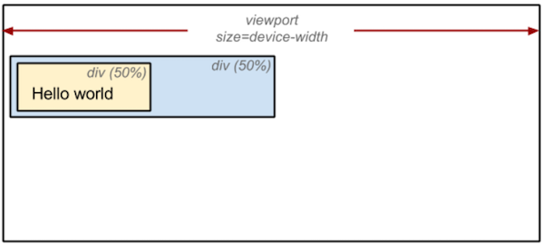

# browser

### 브라우저 로딩 과정

브라우저는 웹 페이지에 필요한 리소스를 내려받고, 해석한 다음에 여러 과정을 거쳐서 콘텐츠를 화면에 보여준다. 크게 **다운로드 -> 파싱 -> 스타일 -> 레이아웃 -> 페인트 -> 합성** 단계라고 볼 수 있다.

</br>

</br>

### 1. 파싱 (Parsing)

브라우저에서 웹 페이지를 로드하면 가장 먼저 **HTML** 파일을 다운로드한다. 파싱은 HTML을 해석하여 DOM (Document Object Model) 트리를 구성하는 단계이다. 파싱 과정 중에 `<script />`,  `<link />`,  `` 를 발견하면 각 리소스를 요청하고, 다운로드한다. 만약 CSS가 포함된 리소스라면 CSSOM (CSS Object Model) 트리 구성도 함께 진행한다.

그렇다면 DOM 트리와 CSSOM 트리가 구성되는 방법을 알아보자.

```html
<html>
  <head>
    <meta name="viewport" content="width=device-width,initial-scale=1">
    <link href="style.css" rel="stylesheet">
    <title>Critical Path</title>
  </head>
  <body>
    <p>Hello <span>web performance</span> students!</p>
    <div></div>
  </body>
</html>
```


파싱이 일어나면 HTML을 해석하여 DOM을 생성한 후에 각 DOM 객체를 트리 데이터 구조로 연결하여 부모 - 자식 관계를 갖도록 만든다. 코드를 보면 `<p>` 태그 안에 `<span>` 태그가 자식 관계로 구성되어 있는 것을 알 수 있다. 부모 노드는 자식 노드를 참조한다.

CSSOM은 `style.css` 처럼 외부 스타일시트 파일이나 내부 스타일시트가 포함되어 있는 경우, CSS를 해석하여 CSSOM 트리를 구성한다.

```css
body { font-size: 16px }
p { font-weight: bold }
span { color: red }
p span { display: none }
img { float: right }
```


`<p>`, `<span>`, `` 와 같은 선택자가 노드로 생성되고, 각 노드는 스타일을 참조한다.

</br>

</br>

### 2. 스타일

DOM트리와 CSSOM트리를 통해 스타일을 매칭시켜주는 과정을 거쳐 **렌더 트리**를 구성하는 단계이다. 

</br>

</br>

### 3. 레이아웃

레이아웃 단계에서는 노드의 정확한 위치와 크기를 계산한다. 노드의 정확한 크기와 위치를 파악하기 위해서 루트부터 노드를 순회하면서 계산하고, 레이아웃 결과로 각 노드의 정확한 위치와 크기를 픽셀값으로 렌더트리에 반영한다. 

**레이아웃 전**



**레이아웃 후**


그림을 보면 알 수 있듯이 레이아웃 과정 후에는 모두 픽셀 값으로 변환된다.

</br>

</br>

### 4. 페인트

페인트는 위치와 관계없는 CSS 속성(색상, 투명도 등)을 적용하는 단계이다. 

</br>

</br>

### 5. 합성 & 렌더링

페인트 단계에서 생성된 레이어를 합성하여 스크린을 업데이트 한다. 합성과 렌더 단계가 끝나면 화면에서 웹 페이지를 볼 수 있다. 

</br>

</br>

### 레이아웃과 리페인트

브라우저 로딩 과정 중 스타일 이후의 과정 (스타일 -> 레이아웃 -> 페인트 -> 합성)을 렌더링이라고 하는데, 이 렌더링 과정은 상황에 따라 반복될 수 있다. 렌더 트리는 DOM 트리, CSSOM 트리가 변경(자바스크립트에 의해)될 때 재구성되고, CSS 속성 값 중에 위치, 넓이, 높이 등의 값이 변경하는 경우에 재구성된다. (**레이아웃** 과정)

요소에 기하학적인 영향 (위치, 넓이, 크기) 을 주는 CSS 속성값이 변경하는 경우 아래 그림과 같은 레이아웃 과정을 거치게 된다.


만약 기하학적인 영향 없이 색상, 투명도 등의 값만 변경되면 레이아웃 과정 없이 바로 페인트 단계로 가게 되는데 이를 **리페인트**라고 한다.


리페인트 과정은 레이아웃에 비해 부하가 적기 때문에 성능 최적화를 위해서는 불필요한 레이아웃이 발생하지 않도록 구현해야 한다.
