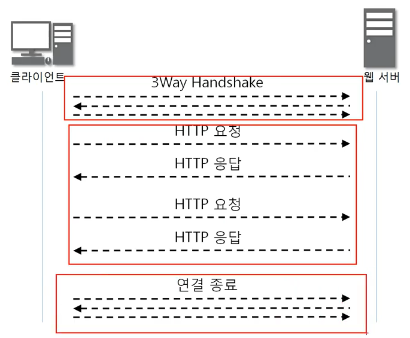

# HTTP 프로토콜

### 웹을 만드는 기술

- HTTP
- HTML
- Javascript
- CSS
- ASP/ASP.NET
- JSP
- PHP
- DB
- Python
- Spring

### HTTP 프로토콜

HyperText Transfer Protocol (하이퍼 텍스트 전송 프로토콜)

www에서 쓰이는 핵심 프로토콜로 문서의 전송을 위해 쓰이며, 오늘날 거의 모든 웹 애플리케이션에서 사용되고 있다. -> 음성, 화상 등 여러 종류의 데이터를 MIME로 정의하여 전송이 가능하다.

HTTP의 특징은 Request / Response 동작에 기반하여 서비스를 제공한다는 점이다. 

- HTTP 1.0의 특징 : "연결 수립, 동작, 연결 해제"의 단순함이 특징이다. HTML 문서를 전송 받은 뒤 연결을 끊고 다시 연결하여 데이터를 전송한다.
- HTTP 1.0의 문제점 : 단순 동작이 반복되어 통신 부하가 발생할 수 있다.

- HTTP 1.0의 문제점을 개선한 HTTP 1.1

