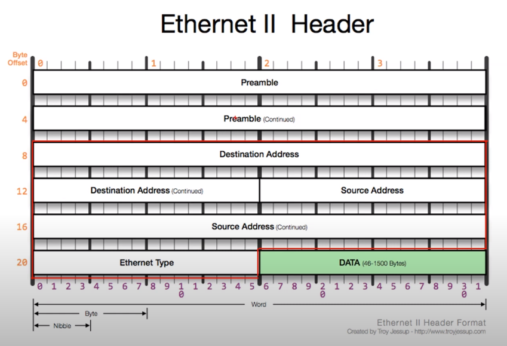

# 3장 데이터 통신

### 2계층

- 하나의 네트워크 대역 (같은 네트워크 상)에 존재하는 여러 장비들 중에서 어떤 장비가 다른 장비에게 데이터 전달
- 오류 제어, 흐름 제어
- 하나의 네트워크 대역 LAN에서만 통신할 때 사용
- 다른 네트워크와 통신할 때는 3계층 필요

### 2계층 사용 주소

- MAC 주소 (물리적인 주소)

  > OUI : IEEE에서 부여하는 일종의 제조회사 식별 ID
  >
  > 고유번호 : 제조사에서 부여한 고유번호

### 2계층 프로토콜

- Ethernet 프로토콜

  > Source Address : 출발지 주소
  >
  > Destinations Address : 목적지 주소

  

  