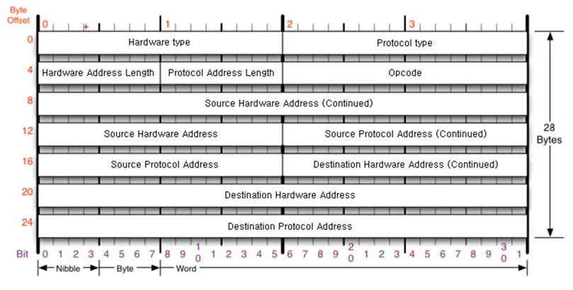

# ARP 프로토콜

### ARP가 하는 일

- 같은 네트워크 대역에서 통신을 하기 위해 필요한 MAC 주소를 IP 주소를 통해 알아오는 프로토콜

- IP 주소는 모르더라도, APR를 통해 통신 가능

  

- ARP 프로토콜 구조

  > Source Hardware Address : 출발지 MAC 주소
  >
  > Source Protocol Address : IPv4 주소
  >
  > Destination Hardware Address : 목적지 MAC 주소
  >
  > Destination Protocol Address : 목적지 IPv4 주소
  >
  > Opcode : MAC 주소를 요청하는 것인지, 응답하는 것인지 나타내는 코드
  >
  > - 물어볼 때는 1, 응답할 때는 2
  >
  > Hardware type : 인터넷
  >
  > Protocol type : IPv4

### ARP 테이블

- 통신 했던 컴퓨터들의 주소 남음

