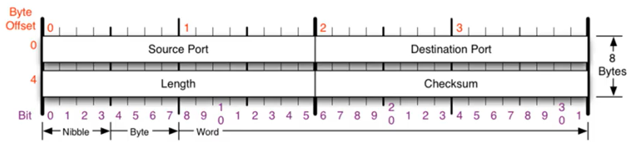

# UDP 프로토콜

사용자 데이터그램 프로토콜 (User Datagram Protocol)은 유니버셜 데이터그램 프로토콜이라고도 한다. UDP의 전송 방식은 단순해서 서비스의 신뢰성이 낮고, 데이터그램 도착 순서가 바뀌거나 혹은 중복되거나 누락될 수 있다. UDP는 일반적으로 오류의 검사와 수정이 필요 없는 프로그램에서 수행한다. 

### UDP 프로토콜 사용하는 프로그램

- DNS 서버 : 도메인을 물어보면 UDP 프로토콜을 통해 IP를 알려준다.

- tftp 서버 : UDP로 파일을 공유하는 서버이다.

- RIP 프로토콜 : 라우팅 정보를 공유한다.

  