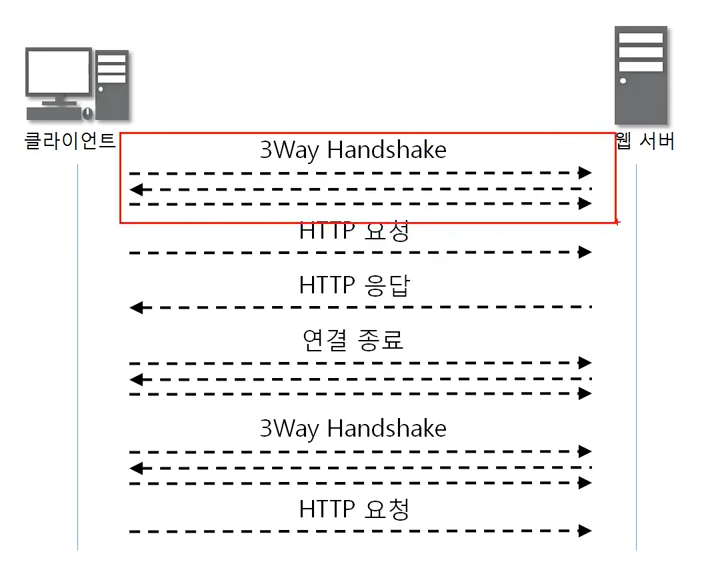
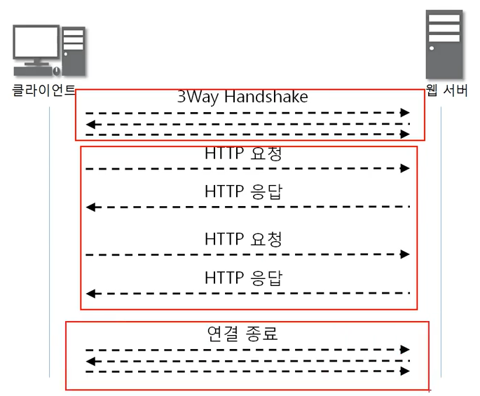

# HTTP

### 웹을 만드는 기술

- HTTP
- HTML
- Javascript
- CSS
- ASP/ASP.NET
- JSP
- PHP
- DB
- Python
- Spring

### HTTP

HyperText Transfer Protocol (하이퍼 텍스트 전송 프로토콜)

www에서 쓰이는 핵심 프로토콜로 문서의 전송을 위해 쓰이며, 오늘날 거의 모든 웹 애플리케이션에서 사용되고 있다. -> 음성, 화상 등 여러 종류의 데이터를 MIME로 정의하여 전송이 가능하다.

HTTP의 특징은 Request / Response 동작에 기반하여 서비스를 제공한다는 점이다. 

- HTTP 1.0의 특징 : "연결 수립, 동작, 연결 해제"의 단순함이 특징이다. HTML 문서를 전송 받은 뒤 연결을 끊고 다시 연결하여 데이터를 전송한다.
- HTTP 1.0의 문제점 : 단순 동작이 반복되어 통신 부하가 발생할 수 있다.

- HTTP 1.0의 문제점을 개선한 HTTP 1.1

### HTTP 구조

요청하는 방식을 정의하고 클라이언트의 정보를 담고 있는 요청 프로토콜 구조

| Request Line |
| :----------: |
|   Headers    |
|     공백     |
|     Body     |

- Request Line

  | 요청 타입 | 공백 | URI  | 공백 | HTTP 버전 |
  | :-------: | :--: | :--: | :--: | :-------: |

  - HTTP 메소드 요청 타입

    | 메소드 종류 |                            설명                             |
    | :---------: | :---------------------------------------------------------: |
    |     GET     |      Client가 Server로부터 문서를 읽어오려 할 때 사용       |
    |    HEAD     | Client가 문서가 아닌 문서에 대한 특정 정보를 원할 경우 사용 |
    |    POST     |       Client가 Server에게 어떤 정보를 전송할 때 사용        |
    |     PUT     |       Client가 Server에 특정 자원을 업로드할 때 사용        |
    |    PATCH    |        PUT과 비슷함, 기존 파일에서 변경사항만을 포함        |
    |    COPY     |            파일을 다른 위치로 복사하기 위해 사용            |
    |    MOVE     |            파일을 다른 위치로 이동하기 위해 사용            |
    |   DELETE    |            Server에서 문서를 제거하기 위해 사용             |
    |    LINK     |      문서에서 다른 위치로의 링크를 생성하기 위해 사용       |
    |   UNLINK    |     LINK Method에 의해 생성된 링크를 삭제하기 위해 사용     |
    |   OPTION    |  Client가 Server에게 사용 가능한 옵션을 질의하기 위해 사용  |

    