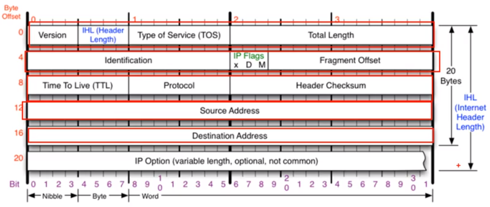

# IP

### IPv4

- 네트워크 상에서 데이터를 교환하기 위한 프로토콜

- 데이터가 정확하게 전달되는 것을 보장하지 않는다.

- 중복된 패킷을 전달하거나 패킷의 순서를 잘못 전달할 가능성이 있다.

- 데이터의 정확하고 순차적인 전달은 TCP에서 보장한다.

  

  - IP Flags
    - D : 패킷을 보내는 사람이 데이터를 쪼개지 않고 보낸다고 명시하는 것
    - M : 데이터가 조각화되어 있다고 명시하는 것
  - Fragment Offest : 시작부분부터 얼마만큼 떨어져있는지 표기
  - Protocol : 상위 프로토콜을 알려주는 것

 
 

### ICMP

특정 대상과 통신이 잘되는지 확인하는 프로토콜. 주로 네트워크 컴퓨터 위에서 돌아가는 운영체제에서 오류 메시지를 전송받는데 사용된다. 프로토콜 구조의 Type과 Code를 통해 오류 메시지를 전송 받는다.

 
 

### 라우팅 테이블

어디로 보내야 하는지 설정되어 있는 라우팅 테이블.

 
 

### IPv4의 조각화

큰 IP 패킷들이 적은 MTU를 갖는 링크를 통하여 전송되려면 여러 개의 작은 패킷으로 조각화되어 전송되어야 한다. 즉 목적지까지 패킷을 전달하는 과정에 통과하는 각 라우터마다 전송에 적합한 프레임으로 변환이 필요하다.
