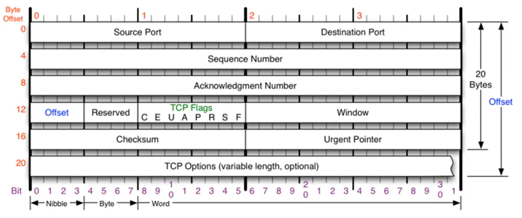

# TCP

### TCP

- Transmission Control Protocol
- 네트워크 통신에서 신뢰적인 연결방식
- Network congestion avoidance algorithm 사용

**문제점**

- 손실 : packet이 손실될 수 있는 문제
- 순서 바뀜 : packet의 순서가 바뀌는 문제
- Congestion : 네트워크가 혼잡한 문제
- Overload : receiver가 overload 되는 문제

**흐름제어와 혼잡제어**

- 흐름제어

  - 송신측과 수신측의 데이터 처리 속도 차이를 해결하기 위한 기법
  - receiver가 sender에게 현재 자신의 상태를 피드백한다는 것

  - Flow Control은 receiver가 packet을 지나치게 많이 받지 않도록 조절하는 것

- 혼잡제어 : 송신측의 데이터 전달과 네트워크의 데이터 처리 속도 차이를 해결하기 위한 기법

### TCP를 이용한 통신과정

**연결 수립 과정**

TCP를 이용한 데이터 통신을 할 때 프로세스와 프로세스를 연결하기 위해 가장 먼저 수행되는 과정

- 클라이언트가 서버에게 요청 패킷을 보내고,
- 서버가 클라이언트의 요청을 받아들이는 패킷을 보내고,
- 클라이언트는 이를 최종적으로 수락하는 패킷을 보낸다.

위의 3개의 과정을 3Way Handshake라고 부른다.

**데이터 송수신 과정**

TCP를 이용한 데이터 통신을 할 때 단순히 TCP 패킷만을 캡슐화해서 통신하는 것이 아닌 페이로드를 포함한 패킷을 주고 받을 때의 일정한 규칙

- 보낸 쪽에서 또 보낼 때는 SEQ 번호와 ACK 번호가 그대로다.
- 받는 쪽에서 SEQ 번호는 받은 ACK 번호가 된다.
- 받는 쪽에서 ACK 번호는 받은 SEQ 번호 + 데이터의 크기

### 흐름제어 (Flow Control)

- 수신측이 송신측보다 데이터 처리 속도가 빠르면 문제 없지만, 송신측의 속도가 빠를 경우 문제가 생긴다.
- 수신측에서 제한된 저장 용량을 초과한 이후에 도착하는 데이터는 손실될 수 있으며, 만약 손실된다면 응답과 데이터 전송이 송/수신 측 간에 불필요하게 빈번이 발생한다.
- 이러한 문제점을 해소하기 위해 송신측에서 데이터 전송량을 수신측에 따라 조절해야 한다.

**해결 방법**

- Stop and Wait : 매번 전송한 패킷에 대해 확인 응답을 받아야만 그 다음 패킷을 전송하는 방법
- Sliding Window (Go Back N ARQ)
  - 수신측에서 설정한 윈도우 크기만큼 송신측에서 확인응답없이 세그먼트를 전송할 수 있게 하여 데이터 흐름을 동적으로 조절하는 제어기법
- 동작방식 : 먼저 윈도우에 포함되는 모든 패킷을 전송하고, 그 패킷들의 전달이 확인되면 해당 윈도우를 옆으로 옮김으로써 그 다음 패킷들을 전송
- Window : TCP/IP를 사용하는 모든 호스트들은 송신하기 위한 것과 수신하기 위한 2개의 Window를 가지고 있다. 호스트들은 실제 데이터를 보내기 전에 '3 way handshaking'을 통해 수신 호스트의 receive window size에 자신의 send window size를 맞추게 된다.

### 혼잡제어 (Congestion Control)

- 송신측의 데이터는 지역망이나 인터넷으로 연결된 대형 네트워크를 통해 전달된다. 만약 한 라우터에 데이터가 몰릴 경우, 자신에게 온 데이터를 모두 처리할 수 없게 된다. 이런 경우 호스트들은 또 다시 재전송을 하게 되고 혼잡만 가중시켜 오버플로우나 데이터 손실을 발생시키게 된다. 따라서 이러한 네트워크의 혼잡을 피하기 위해 송신측에서 보내는 데이터의 전송 속도를 강제로 줄이게 되는데, 이러한 작업을 혼잡제어라고 한다.
- 네트워크 내에 패킷의 수가 과도하게 증가하는 현상을 혼잡이라 하며, 혼잡 현상을 방지하거나 제거하는 기능을 혼잡제어라고 한다.
- 흐름제어가 송신측과 수신측 사이의 전송 속도를 다루는데 반해, 혼잡제어는 호스트와 라우터를 포함한 전송 문제를 다루게 된다.

**해결방법**

- AIMD (Additive Increase / Multiplicative Decrease)
  - 처음에 패킷을 하나씩 보내고 문제 없이 도착하면 window크기를 1씩 증가시키면서 전송하는 방법
  - 패킷 전송에 실패하거나 일정 시간을 넘으면 패킷을 보내는 속도를 절반으로 감소시킨다.
  - 초기에 네트워크의 높은 대역폭을 사용하지 못하며 오랜 시간이 걸리고, 네트워크가 혼잡해지는 상황을 미리 감지하지 못하는 문제점이 있다.
- Slow Start (느린 시작)
  - 패킷을 하나씩 보내면서 시작하고, 패킷이 문제 없이 도착하면 각각의 ACK 패킷마다 window size를 1씩 증가시킨다. 즉 한 주기가 지마녀 window size가 2배로 된다.
  - 전송속도는 AIMD에 반해 지수 함수 꼴로 증가한다. 대신에 혼잡 현상이 발생하면 window size를 1로 떨어뜨리게 된다.
- Fast Retransmit (빠른 재전송)
  - 빠른 재전송은 TCP의 혼잡 조절에 추가된 정책이다.
  - 패킷을 받는 쪽에서 먼저 도착해야할 패킷이 도착하지 않고 다음 패킷이 도착한 경우에도 ACK 패킷을 보내게 된다.
  - 순서대로 잘 도착한 마지막 패킷의 다음 패킷의 순번을 ACK 패킷에 실어서 보내게 되므로, 중간에 하나가 손실되게 되면 송신 측에서는 순번이 중복된 ACK 패킷을 받게 된다. 이것을 감지하는 순간 문제가 되는 순번의 패킷을 재전송해줄 수 있다.
- Fast Recovery (빠른 회복)
  - 혼잡한 상태가 되면 window size를 1로 줄이지 않고 반으로 줄이고 선형 증가시키는 방법이다. 이 정책까지 적용하면 혼잡 상황을 한번 겪고 나서부터는 순수한 AIMD 방식으로 동작하게 된다.

