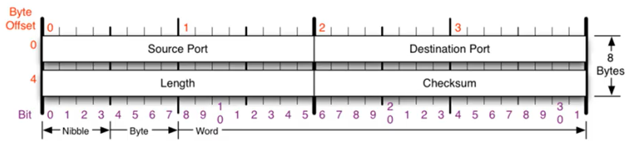

# UDP

### UDP

- User Datagram Protocol
- 비연결형, 신뢰성 없는 전송 프로토콜
- 데이터그램 단위로 쪼개면서 전송을 해야하기 때문에 전송 계층에 해당
- Transport Layer에서 사용하는 프로토콜

**TCP와 UDP가 나오게 된 이유**

IP에서 오류가 발생한다면 ICMP에서 알려준다. 하지만 ICMP는 알려주기만 할 뿐 대처를 하지 못하기 때문에 IP보다 위에서 처리를 해줘야 한다. 이러한 문제를 해결하기 위해 TCP와 UDP가 나오게 되었다.

**TCP와 UDP가 해결하는 오류**

- TCP : 데이터의 분실, 중복, 순서 뒤바뀜 등을 자동으로 보정해줘서 송수신 데이터의 정확한 전달을 할 수 있도록 해준다.
- UDP : IP가 제공하는 정도의 수준만을 제공하는 간단한 IP 상위 계층의 프로토콜이다.

**UDP 사용 이유**

- 데이터의 처리가 빠르다.

**DNS에서 UDP를 사용하는 이유**

- Request의 양이 작음 => UDP Request에 담길 수 있다.
- 3 way handshaking으로 연결을 유지할 필요가 없다.
- Request에 대한 손실은 Application Layer에서 제어가 가능하다.
- DNS : port 53번

- Source Port : 시작 포트
- Destination Port : 도착지 포트
- Length : 길이
- Checksum : 오류 검출

 
 

### UDP 프로토콜 사용하는 프로그램

- DNS 서버 : 도메인을 물어보면 UDP 프로토콜을 통해 IP를 알려준다.

  > TCP가 3-way handshake를 사용하는 반면, UDP는 connection을 유지할 필요가 없음
  >
  > DNS request는 UDP segment에 들어갈 정도로 크기가 작음

- tftp 서버 : UDP로 파일을 공유하는 서버이다.

- RIP 프로토콜 : 라우팅 정보를 공유한다.

  
